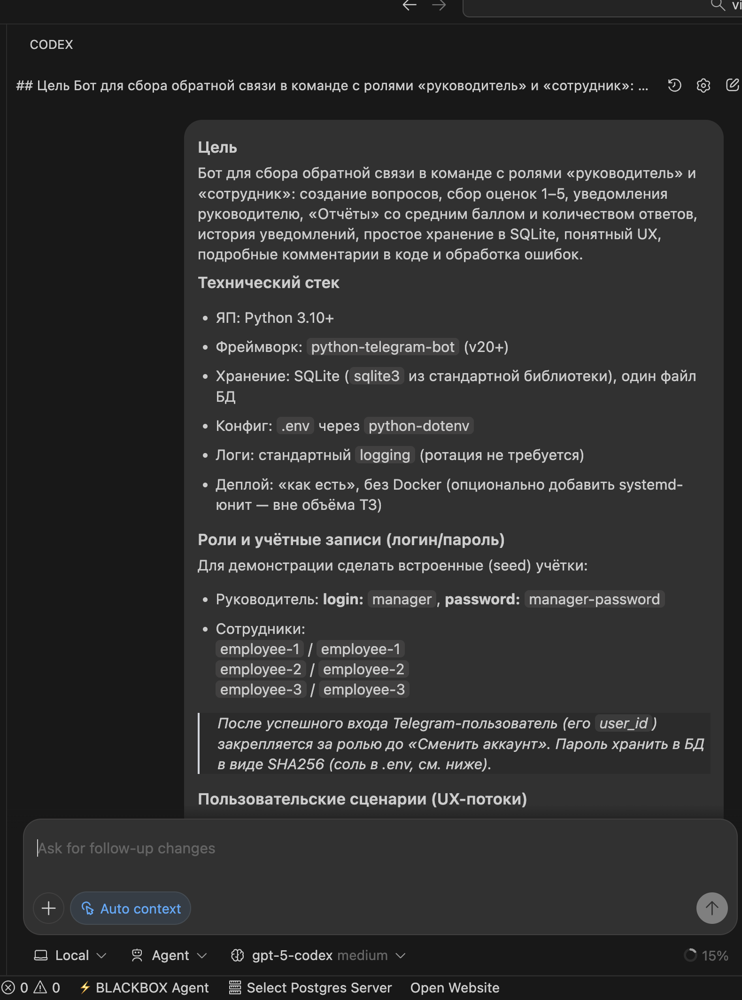
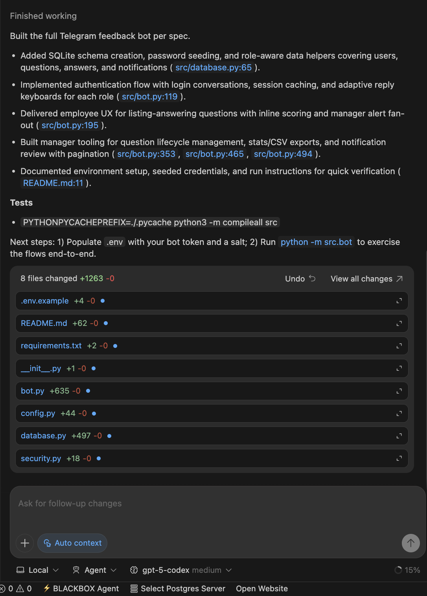
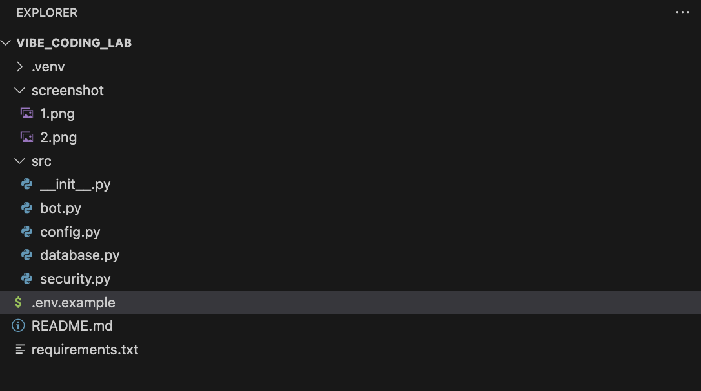

# Отчет по лабораторной №1

University: [ITMO University](https://itmo.ru/ru/)  
Faculty: FTMI  
Course: Vibe-coding-for-business  
Year: 2025/2026  
Group: U4225  
Author: Gunin Nikita Alekseevich  
Lab: Lab1  
Date of create: 24.10.2025  
Date of finished:  

Доказательствами выполнения лабораторной работы прошу считать историю изменений этого репозитория и приложенные материалы.

## Ход работы

### Шаг 0. Подготовка проектного окружения

Написание промпта: 

Для начала был сделан промпт для формирования финального промпта – промпт сохранен в файле `prompt1.txt`.  
По итогу итоговый промпт (`prompt2.txt`) был загружен в Codex (плагин VS Code) для создания итогового бота.  

В файле VIDEO_DEMO.mp4 приложена видео-демонстрация.

<video controls src="https://raw.githubusercontent.com/thegunin/vibe_coding_lab_gunin/main/lab1/VIDEO_DEMO.mp4"></video>

Итог реализации бота описан в шагах ниже (также прилагаю визуализацию)

  
  

### Шаг 1. Подготовка проектного окружения

1. Создан репозиторий `vibe_coding_lab` и настроена структура проекта для Telegram-бота сбора обратной связи.  
2. Добавлены файлы `requirements.txt`, `.env.example`, выполнена настройка виртуального окружения.  
3. В `.env` прописаны токен бота, соль для хеширования паролей и путь к SQLite-базе.

### Шаг 2. Реализация слоя хранения данных

1. Реализован модуль `src/database.py` с инициализацией схемы и сидированием учётных записей для руководителя и сотрудников.  
2. Созданы запросы для работы с пользователями, вопросами, ответами, уведомлениями и статистикой.  
3. Пароли хранятся в виде SHA256-хешей с использованием соли (`src/security.py`).

### Шаг 3. Реализация логики Telegram-бота

1. В `src/bot.py` настроен `Application` библиотеки `python-telegram-bot` (v20) с обработчиками команд и сообщений.  
2. Реализованы сценарии авторизации, ролевые меню, создание вопросов руководителем, ответы сотрудников с inline-кнопками.  
3. Добавлены уведомления руководителю о новых и изменённых ответах, просмотр истории уведомлений с пагинацией.

### Шаг 4. Отчёты и экспорт данных

1. Для руководителя доступен раздел «Отчёты» с расчётом среднего балла, медианы, распределения оценок и процента участия.  
2. Предусмотрен экспорт результатов по каждому вопросу в CSV-файл с форматом `question_id, question_text, employee_login, score, created_at`.  
3. Добавлен `README.md` с инструкцией по запуску и описанием основных сценариев использования бота.

### Шаг 5. Тестирование и запуск

1. Выполнена проверка корректности импорта модулей (`python -m compileall src`).  
2. Проведён тестовый запуск бота (`python -m src.bot`) после настройки `.env`.  
3. Подтверждена совместимость с Python 3.12; учтено ограничение библиотеки на работу с версиями Python младше 3.13.

## Результаты лабораторной работы

В результате лабораторной работы №1 разработан Telegram-бот, обеспечивающий полный цикл сбора обратной связи в команде:

1. Авторизация пользователей с закреплением Telegram user_id и управлением ролями.  
2. Создание и управление вопросами руководителем, получение статистики и экспорт данных.  
3. Ответы сотрудников с возможностью изменения оценок до закрытия вопроса.  
4. Система уведомлений для руководителя о новых и обновлённых ответах.  
5. Документированная конфигурация проекта через `.env` и подробные инструкции по запуску.

