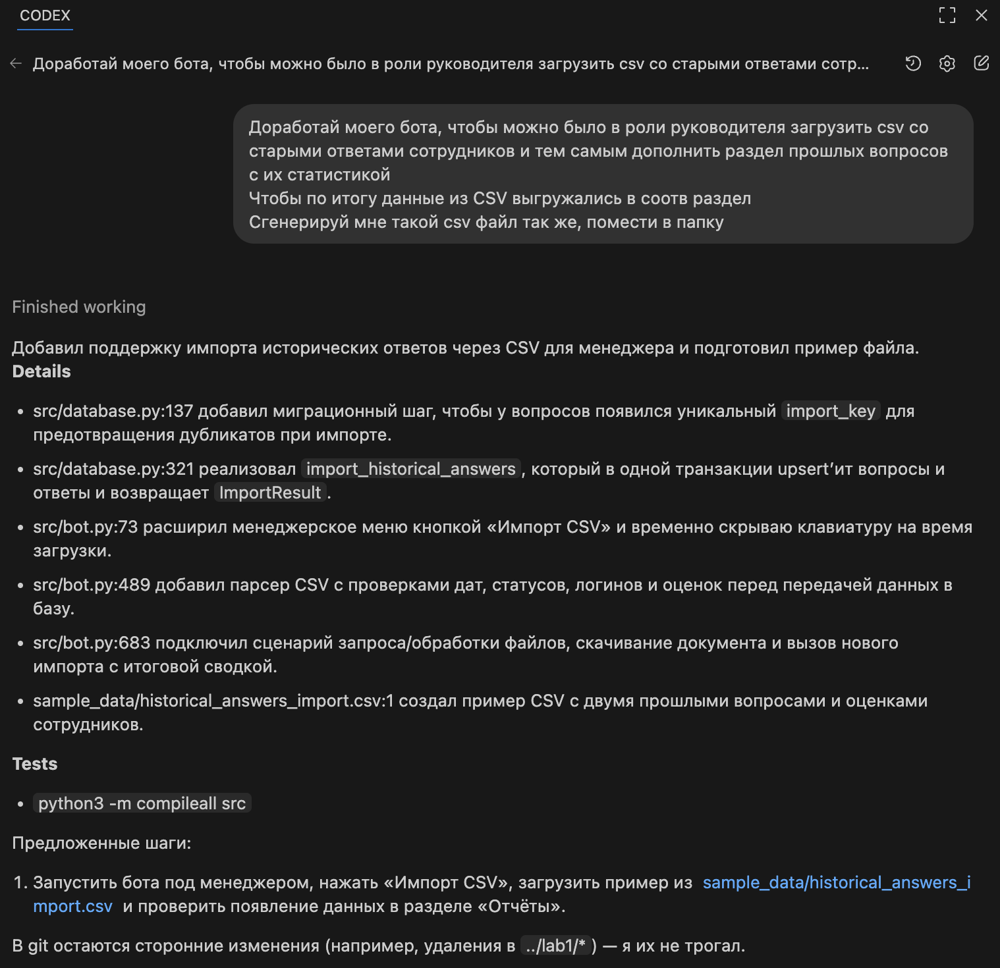
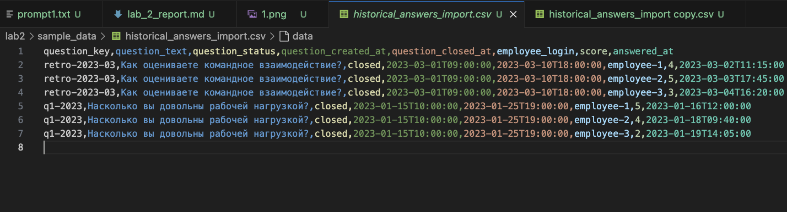

# Отчет по лабораторной №2

University: [ITMO University](https://itmo.ru/ru/)  
Faculty: FTMI  
Course: Vibe-coding-for-business  
Year: 2025/2026  
Group: U4225  
Author: Gunin Nikita Alekseevich  
Lab: Lab2  
Date of create: 02.11.2025  
Date of finished: 02.11.2025  

Доказательствами выполнения лабораторной работы прошу считать историю изменений этого репозитория и приложенные материалы.

**Исходное состояние.** На момент начала доработки бот уже поддерживал роли «руководитель» и «сотрудник», аутентификацию с привязкой Telegram user_id, создание вопросов, ответы сотрудников с обновлением оценок, уведомления руководителям и отчеты со статистикой и экспортом ответов по каждому вопросу.

## Описание интеграции

**Источник данных.** Исторические ответы сотрудников, предоставленные руководителем в виде CSV-файла (`sample_data/historical_answers_import.csv`).

**Почему выбран CSV.** Формат соответствует тому, как HR-команды хранят результаты прошлых опросов (табличные выгрузки из систем опросов). CSV легко формировать вручную или экспортировать из Excel/Google Sheets, что упрощает передачу данных менеджеру.

**Структура данных.**
- `question_key` — уникальный идентификатор вопроса для дедупликации при импортe;
- `question_text`, `question_status`, `question_created_at`, `question_closed_at` — метаданные вопроса (ISO 8601, Moscow TZ без смещения);
- `employee_login` — логин существующего сотрудника в базе бота;
- `score` — оценка от 1 до 5;
- `answered_at` — дата/время ответа (ISO 8601).

## Промпт для LLM

**Исходный промпт.** Содержится в `prompt1.txt` и описывает требования к расширению функциональности бота и подготовке отчета.

**Итерации.** Дополнительных итераций промпта не потребовалось: доработка реализована по исходным инструкциям.

**Финальный промпт.** Совпадает с содержимым `prompt1.txt`.

## Реализация

**Как работает интеграция.** Руководитель выбирает пункт меню «Импорт CSV», отправляет файл с историческими ответами, бот валидирует структуру и данные, мапит сотрудников по логинам и сохраняет ответы, создавая или обновляя вопросы и их статистику. После завершения импорта бот возвращает сводку (сколько вопросов создано/обновлено и сколько ответов добавлено).

**Ключевые фрагменты кода.**
- `src/bot.py:52-63` — дата-класс `HistoricalCsvRow` для нормализации строк CSV.
- `src/bot.py:489-559` — парсер CSV с проверкой обязательных колонок, дат, диапазонов оценок и консистентности метаданных вопросов.
- `src/bot.py:683-746` — обработчики выбора «Импорт CSV» и загрузки документа, формирующие ответ для менеджера.
- `src/database.py:137-143` — миграция добавляет поле `import_key` в таблицу вопросов.
- `src/database.py:321-425` — метод `import_historical_answers` upsert'ит вопросы и ответы в одной транзакции и возвращает `ImportResult`.

**Используемые библиотеки.**
- `python-telegram-bot` — обработка команд и документов Telegram;
- `csv`, `io` из стандартной библиотеки — чтение и буферизация CSV;
- `datetime` — нормализация ISO-дат;
- `dataclasses` — сериализация структур данных;
- `sqlite3` — хранение вопросов и ответов; транзакционный импорт.

## Тестирование

**Скриншоты работы.** Подготовка новых скриншотов с процессом импорта CSV запланирована (ранее добавленные изображения лежат в `screenshot/`).
  
  

**Примеры запросов и ответов.**
1. Руководитель нажимает «Импорт CSV» → бот просит отправить файл.
2. Отправляем `historical_answers_import.csv` → бот сообщает об успешном импорте и показывает сводку.
3. Переходим в «Отчёты» → в списке вопросов отображается статистика с учетом исторических данных.

**Видео-демо.** Доступно по ссылке: https://drive.google.com/file/d/1WPa3qoWoah4HtbVlB9s8-HjUzuTPWJzJ/view?usp=sharing 

## Трудности и решения

**Проблемы.**
- Нужно было обеспечить идемпотентность импорта, чтобы повторная загрузка файла не создавала дубликаты вопросов.
- Требовалось сопоставить строки CSV с существующими учетными записями сотрудников и корректно обработать несоответствия.

**Решения.**
- Добавлено поле `import_key` в таблицу `questions`, а импорт выполняет upsert по этому ключу и логину сотрудника.
- Перед записью выполняется проверка всех логинов; при отсутствии пользователя бот возвращает список проблем и отменяет импорт.

## Выводы

**Что получилось хорошо.**
- Импорт исторических ответов полностью автоматизирует расширение статистики без ручного вмешательства в базу.
- CSV-парсер валидирует данные и предоставляет менеджеру понятную обратную связь о результатах импорта.

**Что можно улучшить.**
- Добавить предпросмотр данных перед импортом и возможность отката изменений.
- Реализовать загрузку через Google Sheets API для тех, кто ведет данные в «живых» таблицах.
