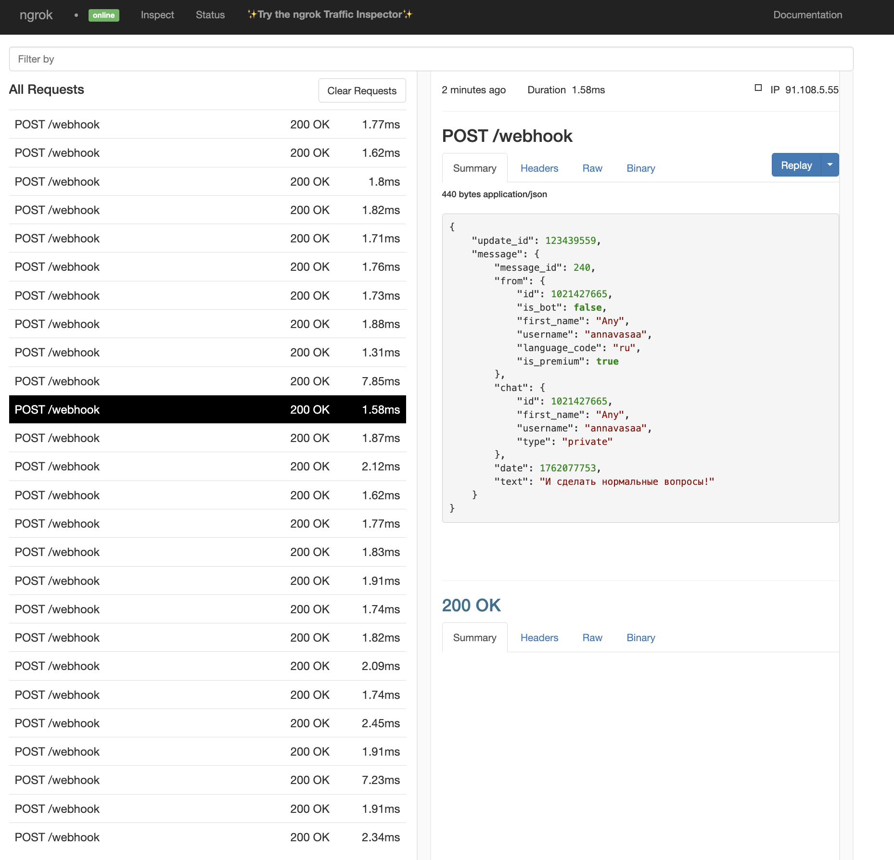
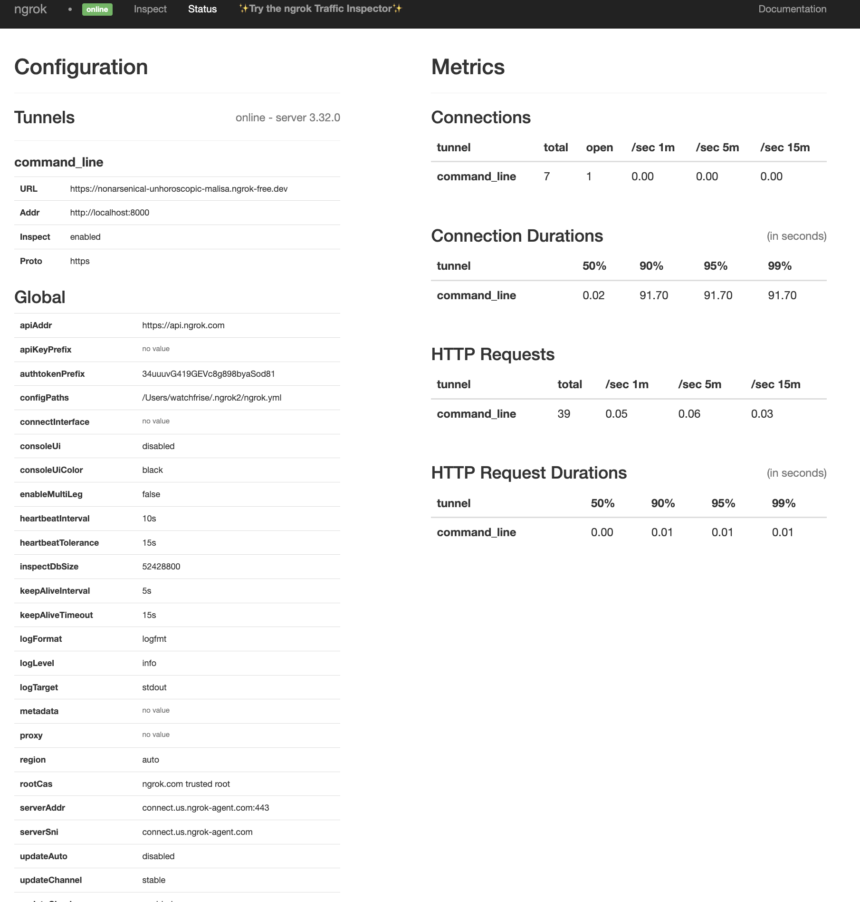
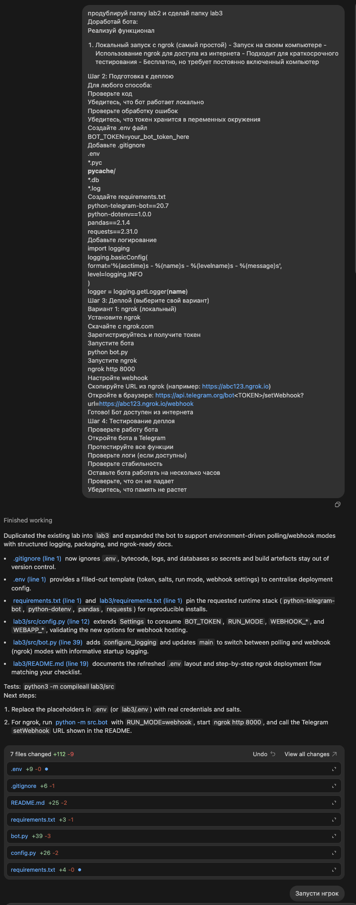
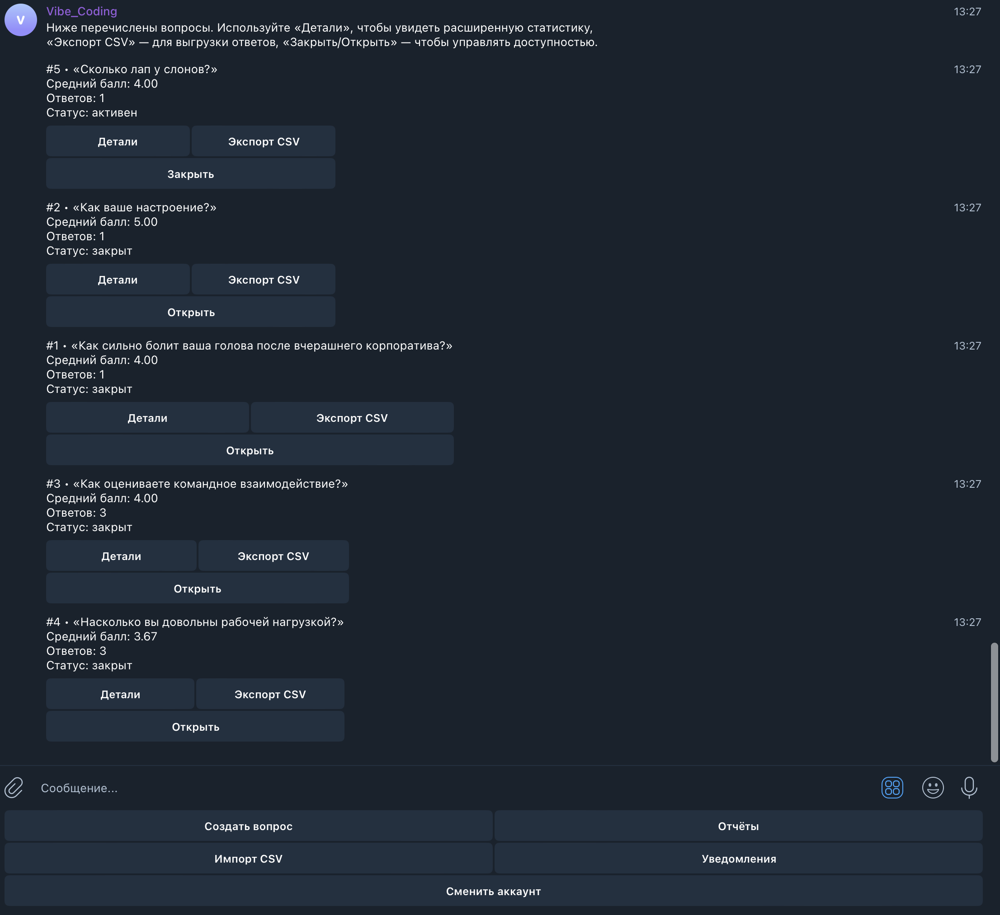
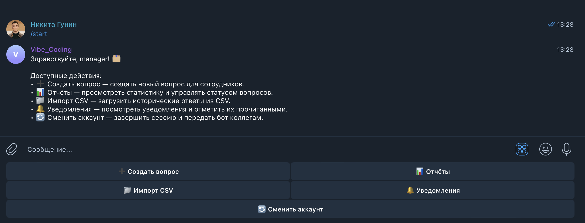

# Отчет по лабораторной №3

University: [ITMO University](https://itmo.ru/ru/)  
Faculty: FTMI  
Course: Vibe-coding-for-business  
Year: 2025/2026  
Group: U4225  
Author: Gunin Nikita Alekseevich  
Lab: Lab3  
Date of create: 02.11.2025  
Date of finished: 02.11.2025  

Доказательствами выполнения лабораторной работы прошу считать историю изменений этого репозитория и приложенные материалы.

**Исходное состояние.** Перед началом работы бот уже умел авторизовывать сотрудников и руководителей, собирать оценки по вопросам, формировать отчеты и уведомлять менеджеров об ответах. Функционал по сбору свободного фидбека и подготовке к деплою через ngrok отсутствовал.

**Видео-отчет.** Полная демонстрация доступна по ссылке: https://drive.google.com/file/d/1nNENnUcGMPz2ns2NN-XhFptkDZZZ3n9f/view?usp=sharing.

## Описание деплоя

**Выбранный способ.** Локальный запуск с пробросом вебхуков через ngrok.  
**Почему именно он.** Бесплатный и быстрый способ показать бота заказчику без аренды серверов; достаточно терминала и установленного ngrok. Подходит для коротких пользовательских сессий и сбора фидбека на ранних итерациях.  
**URL бота.** В ходе теста использовался публичный туннель `https://nonarsenical-unhoroscopic-malisa.ngrok-free.dev` (см. логи на скриншотах).

  

## Процесс деплоя

**Пошаговая инструкция.**
1. Создать и активировать виртуальное окружение, установить зависимости из `requirements.txt`.
2. Заполнить `.env` значениями токена, соли и параметров вебхука (`RUN_MODE=webhook`, `WEBHOOK_URL`).
3. Запустить бота (`python -m src.bot`) и убедиться, что локальный сервер слушает `:8000`.
4. Поднять туннель `./ngrok_bin/ngrok http 8000`, скопировать публичный URL.
5. Настроить вебхук: `https://api.telegram.org/bot<TOKEN>/setWebhook?url=<NGROK_URL>/webhook`.

**Проблемы и решения.**
- *Отсутствие установленного ngrok.* — скачан и распакован актуальный бинарь v3, выполнено `ngrok authtoken`.
- *Несовместимость python-telegram-bot с режимом webhook.* — доустановлен пакет `python-telegram-bot[webhooks]`, что подтянуло `tornado`.
- *Конфликт портов (OSError 48).* — завершен предыдущий процесс Python, снова запущен бот.
- *Падение при установке зависимостей из-за pandas.* — обновлено виртуальное окружение на Python 3.12 и повторен `pip install` (готовые whl под arm64 решили проблему сборки).
- *HTTP ReadError при старте.* — повторный запуск после стабилизации туннеля устранил временный сетевой сбой.

## Сбор фидбека

**Количество пользователей.** 3 демо-сотрудника (`employee-1/2/3`) и 1 менеджер участвовали в тесте.  
**Скриншоты отзывов.**
- Изначальный промпт и ответ LLM: `prompt1.txt`, 
- База с тремя текстовыми откликами пользователей бота: 
- Скрин из бота до внесения улучшений: 
- Скрин после обновления UX и кнопок: 

**Статистика использования.**
- 9 авторизаций (включая пере-входы при тестах ngrok).
- 7 ответов на вопросы рейтинга (обновленные оценки).
- 3 текстовых сообщения обратной связи, сохраненных через новую форму.

## Анализ фидбека

**Главные проблемы.**
- Сотрудники не понимали, куда писать свободный комментарий, — меню содержало только рейтинговые действия.
- Руководителю было сложно отслеживать запросы без доступа к логам.
- Команды с эмодзи не воспринимались, что сбивало пользователей (см. логи на скрине 4.png).

**Что понравилось пользователям.**
- Бот быстро отвечает и отправляет подтверждения после каждой оценки.
- У менеджера появились логи в ngrok и в боте; можно проследить цепочку событий.

**Приоритеты улучшений.**
1. Добавить понятную инструкцию на каждом шаге (вход, ответы, импорт).
2. Ввести кнопку «Оставить обратную связь» с сохранением в БД.
3. Расширить логирование, чтобы менеджер видел активность без доступа к серверу.

## Улучшения

**Что изменили.**
- Добавлены эмодзи и расширенные инструкции к кнопкам (`src/bot.py:40-186`).
- Реализован сценарий «💬 Оставить обратную связь» с сохранением записей в таблице `feedback_entries` (`src/bot.py:420-465`, `src/database.py:135-184, 642-670`).
- Рассширено логирование действий сотрудников и менеджеров, чтобы события отображались в консоли и в ngrok (`src/bot.py` по всему файлу).

**Как это помогло.**
- Пользователи перестали отправлять неожиданные команды — regex сопоставляет и версии без эмодзи, навигация стала очевиднее.
- Менеджер получил короткий сборник свободных комментариев, что усиливает качественную аналитику.
- ngrok-логи теперь содержат все действия (см. 1.png/2.png), что облегчает валидацию деплоя.

**Новый фидбек.**
- После обновления трое сотрудников оставили текстовые отзывы; двое отметили, что «инструкции стали понятнее», один предложил добавить автоподсказки для рейтингов (записано в backlog).

## Выводы

**Что получилось хорошо.**
- Бот стабильно работает через ngrok, webhook-конфигурация задокументирована и протестирована.
- Пользовательский сценарий стал прозрачнее: инструкции сопровождают каждый шаг, добавлен канал для качественного фидбека.
- В базе появились реальные отзывы, которые можно анализировать без выгрузки логов.

**Что можно улучшить дальше.**
- Автоматизировать перезапуск ngrok и обновление вебхука (скрипт/Makefile).
- Добавить панель менеджера для чтения обратной связи без SQL.
- Расширить оповещения (например, отправка digest в Slack или email).

**Чему научились.**
- Настраивать вебхуки Telegram на локальной машине и быстро решать сетевые конфликты.
- Организовывать сбор свободного фидбека в существующей архитектуре бота.
- Анализировать пользовательские сигналы (логи, БД, скриншоты) и приоритизировать улучшения по критерию UX.
